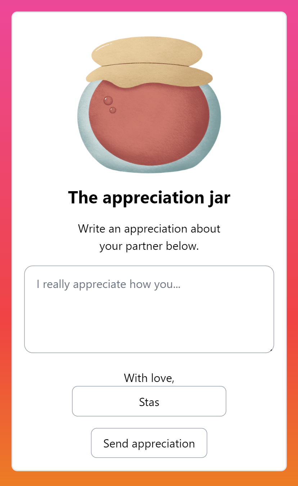

# Apprectiation Jar

This is a small web application for creating a virtual [appreciation/gratitude jar](https://www.mindbodygreen.com/0-11062/how-to-create-a-gratitude-jar.html). It allows you to leave appreciations for your partner that can be shown on a screen or consumed via a JSON API.



## Run locally

First, copy the config file and set the settings you wish:

```bash
cp config.sample.php config.php
```

### Option 1: Run with JavaScript, PHP and Tailwind compiler

```bash
nvm use
npm i
composer install
npm run dev
npm run dev-styles # In separate console
```

Now you can visit:

http://localhost:8080/


### Option 2: Run with PHP and development Tailwind compiler

First, set `development => 'true'` in `config.php`.

```bash
composer install
php -S localhost:8080 -t src
```

Now you can visit:

http://localhost:8080/

## Endpoints

#### Add an appreciation

http://localhost:8080/

(Names need to be whitelisted to act as a rudimentary spam filter, see `config.php` to set whitelisted names)

#### Show latest appreciation

http://localhost:8080/latest

#### Administrate / delete appreciations

http://localhost:8080/admin/<password> (See `config.php` to set a password)

(Appreciations are partially hidden to avoid spoilers! 🙈)

### JSON API

Latest appreciation:
http://localhost:8080/api/appreciation/latest

Any appreciation by ID:
http://localhost:8080/api/appreciation/<id>


## Dump schema 

```
sqlite3 db/_appreciations.sqlite .schema > schema.sql
```

(Then add it in `Db::initialize()`)

#### Subfolder configuration

If you put this project into a subfolder, edit the `$baseFolder` variable in `index.php`